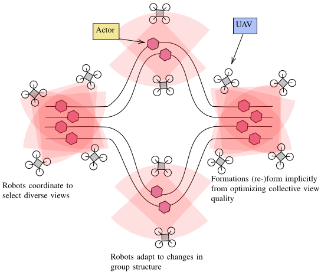

# Multi-Drone Multi-Actor Filming

[Multi-Robot Planning for Filming Groups of Moving Actors Leveraging Submodularity and Pixel Density](https://arxiv.org/abs/2404.03103)

This package provides implementations of multi-robot planners for
filming groups of moving actors (see reference details).
This repo is based on the
[MultiAgentSensing](https://github.com/mcorah/MultiAgentSensing) package
which provides implementations and examples of submodular maximization
algorithms.

Our approach solves challenging view planning problems like the one below where
groups may frequently split, join, and reassemble, and we do so via a
combination of submodular maximization, value iteration, and a view reward based
on pixel densities over actors surfaces:



## Installation

The easiest way to run this code is to use the provided Dockerfile and scripts.
To do this one must first install [docker](https://www.docker.com/)

To build
* `cd docker-scripts`
* `sudo ./build`

To get a shell
* `sudo ./start`

Once in a shell, one can run/interact with the multi-agent model MDMA in the Julia interpreter.

For example:
* `julia`
* `julia> using MDMA`

To run all the experiments and generate all outputs
* `julia> conf = ExperimentsConfig("./experiments")`
* `julia> run_all_experiments(conf)`

Running the experiments

To get a jupyter notebook
* `sudo ./run_jupyter`


## Example code

**Does anything currently belong under examples?**

## References

If you use this package in published work, pleace consider citing either of the
following:

```
@inproceedings{hughes2024cdc,
  title = {Multi-Robot Planning for Filming Groups of Moving Actors Leveraging
           Submodularity and Pixel Density},
  booktitle={Proc. of the {IEEE} Conf. on Decision and Control},
  author = {Hughes, Skyler and Rebecca Martin and Corah, Micah and Scherer, Sebastian},
  year = {2024},
  month=dec
}
```
